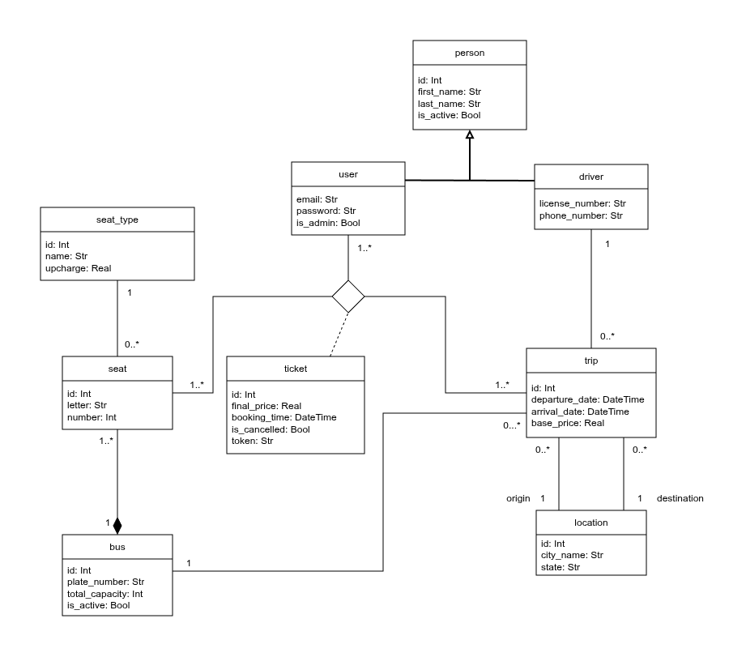

# Bus Ticket
[Administración de Proyecto en Jira](https://alejosilvalau.atlassian.net/jira/software/projects/KAN/boards/1?atlOrigin=eyJpIjoiZjY1NmQ0ZDM4NDNjNDM4MmExNDllZmNhM2I5N2UzODAiLCJwIjoiaiJ9)
- Se necesita una cuenta de Atlassian para ver el proyecto

## Integrantes
- 47868, Silva Alejo Lautaro
- 52803, Libardi Valentino Bruno

## Enunciado General
El sistema permite gestionar integralmente la compra, reserva y administración de boletos para colectivos de larga distancia en Argentina, incluyendo la consulta de horarios, listado de viajes (filtrable por atributos como destino, punto de partida, precio, tipo de asiento, fecha y hora de salida), manejo de asientos libres, y emisión del pasaje en formato digital o PDF. 

Incorpora perfiles de usuario y administrador, manejo de errores con mensajes claros en la interfaz, y excepciones personalizadas, asegurando eficiencia, accesibilidad y control para pasajeros, empresas y entes reguladores.

## Diagrama de Clases

## Casos de Uso para la REGULARIDAD
| Requerimiento | Detalle/Listado de casos incluidos |
| --- | --- |
| ABMC Simple | Bus, Location |
| ABMC Dependiente | Seat |
| CU NO-ABMC | Creación de viaje |
| Listado Simple | Listado de asientos disponibles en cada colectivo |
| Listado Complejo | Listado de viajes disponibles, pudiendose filtrar por atributos como destino, punto de partida, precio, tipo de asiento, fecha y hora de salida |

## Casos de Uso para la AP DIRECTA
| Requerimiento | Detalle/Listado de casos incluidos |
| --- | --- |
| ABMC | User, Driver, Bus, Location, Seat, Seat Type |
| CU "Complejo"(nivel resumen) | Creación de viaje y reserva de pasaje  |
| Listado complejo | Listado de viajes disponibles, pudiendose filtrar por atributos como destino, punto de partida, precio, tipo de asiento, fecha y hora de salida  |
| Nivel de acceso | User y Admin |
|Manejo de errores| Mensajes en la UI de retorno en API |
| publicar el sitio | No obligatorio, hacerlo con AWS si entra en tier gratis |

### Requerimientos extra - AD
| Requerimiento | Detalle/Listado de casos incluidos |
| --- | --- |
| Custom exceptions | Excepciones personalizadas mediante subclases, validando las reglas de negocio|

