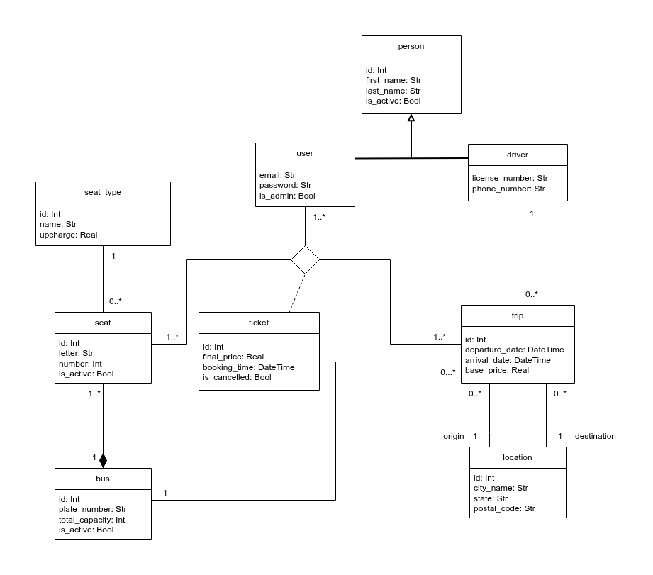
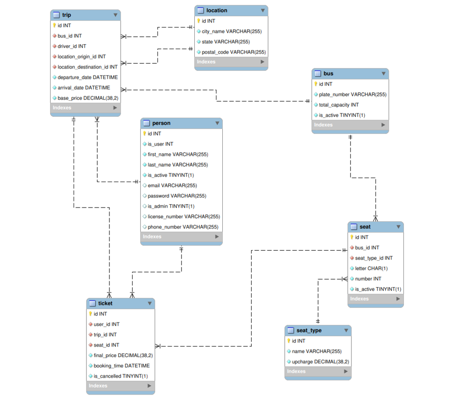

# Bus Ticket
[Administración de Proyecto en Jira](https://alejosilvalau.atlassian.net/jira/software/projects/KAN/boards/1?atlOrigin=eyJpIjoiZjY1NmQ0ZDM4NDNjNDM4MmExNDllZmNhM2I5N2UzODAiLCJwIjoiaiJ9)
- Se necesita una cuenta de Atlassian para ver el proyecto

## Integrantes
- 47868, Silva Alejo Lautaro
- 52803, Libardi Valentino Bruno

## Enunciado General
El sistema permite gestionar integralmente la compra, reserva y administración de boletos para colectivos de larga distancia en Argentina, incluyendo la consulta de horarios, listado de viajes (filtrable por atributos como destino, punto de partida, precio, tipo de asiento, fecha y hora de salida), manejo de asientos libres, y emisión del pasaje en formato digital o PDF. 

Incorpora perfiles de usuario y administrador, manejo de errores con mensajes claros en la interfaz, y excepciones personalizadas, asegurando eficiencia, accesibilidad y control para pasajeros, empresas y entes reguladores.

## Video Demo de Proyecto:
[Video Demo](https://www.youtube.com/)   

## Diagrama de Clases


## Modelo de Datos
  

## Casos de Uso para la REGULARIDAD
| Requerimiento | Detalle/Listado de casos incluidos |
| --- | --- |
| ABMC Simple | Bus, Location |
| ABMC Dependiente | Seat |
| CU NO-ABMC | Creación de viaje |
| Listado Simple | Listado de asientos disponibles en cada viaje |
| Listado Complejo | Listado de viajes disponibles, pudiendose filtrar por atributos como destino, punto de partida, precio, tipo de asiento, fecha y hora de salida |

## Casos de Uso para la AP DIRECTA
| Requerimiento | Detalle/Listado de casos incluidos |
| --- | --- |
| ABMC | User, Driver, Bus, Location, Seat, Seat Type |
| CU "Complejo"(nivel resumen) | Creación de viaje y reserva de pasaje  |
| Listado complejo | Listado de viajes disponibles, pudiendose filtrar por atributos como destino, punto de partida, precio, tipo de asiento, fecha y hora de salida  |
| Nivel de acceso | User y Admin |
|Manejo de errores| Mensajes en la UI de retorno en API |
| publicar el sitio | No obligatorio, hacerlo con AWS si entra en tier gratis |

### Requerimientos Extra - AD
| Requerimiento | Detalle/Listado de casos incluidos |
| --- | --- |
| Custom exceptions | Excepciones personalizadas mediante subclases, validando las reglas de negocio|

### Ruta de Listado Simple
- GET `/api/v1/journeys/catalog/trips/{id}/available/seats`

### Ruta de Listado Complejo
- GET `/api/v1/journeys/catalog/trips/available/search`

## Pasos para Ejecutar el Proyecto

### Comandos del Package Manager Maven
- `./mvnw install`
- `./mvnw clean compile`
- `./mvnw spring-boot:run`

### Crear archivo `application.properties` en `src/main/resources` con el siguiente contenido:
```properties
spring.application.name=bus-ticket

# Database Configuration
spring.datasource.url=jdbc:mysql://localhost:PUERTO/bus_ticket?allowPublicKeyRetrieval=true&useSSL=false&serverTimezone=UTC
spring.datasource.username=USUARIO
spring.datasource.password=CONTRASEÑA
# spring.datasource.driver-class-name=com.mysql.cj.jdbc.Driver

# JPA and Hibernate Configuration
# spring.jpa.database-platform=org.hibernate.dialect.MySQLDialect
spring.jpa.hibernate.ddl-auto=none
spring.jpa.show-sql=true
spring.jpa.properties.hibernate.format_sql=true
spring.jpa.properties.hibernate.jdbc.time_zone=UTC

# Jackson Configuration - Output UTC times
spring.jackson.time-zone=UTC
spring.jackson.deserialization.fail-on-unknown-properties=true

# Pageable Configuration
spring.data.web.pageable.default-page-size=20
spring.data.web.pageable.page-parameter=page
spring.data.web.pageable.size-parameter=size
spring.data.web.pageable.max-page-size=100

# CORS Configuration
app.cors.allowed-origins=http://localhost:3000,http://localhost:5173,http://localhost:5174

# JWT Configuration
app.jwtSecret=SECRETO
app.jwtExpirationMs=10800000

# Logging Configuration
logging.level.com.example.demo=INFO
logging.level.org.springframework.security=DEBUG
logging.level.org.springframework.web=DEBUG
```

### Problemas con Puerto por Defecto
- Si el puerto 8080, puede matar el proceso con `lsof -ti :PORT | xargs kill -9` en una terminal de Bash

### Link de Prueba de API
Una vez ejecutado el proyecto, se puede probar la API con Swagger mediante:
`http://localhost:8080/swagger-ui/index.html`
